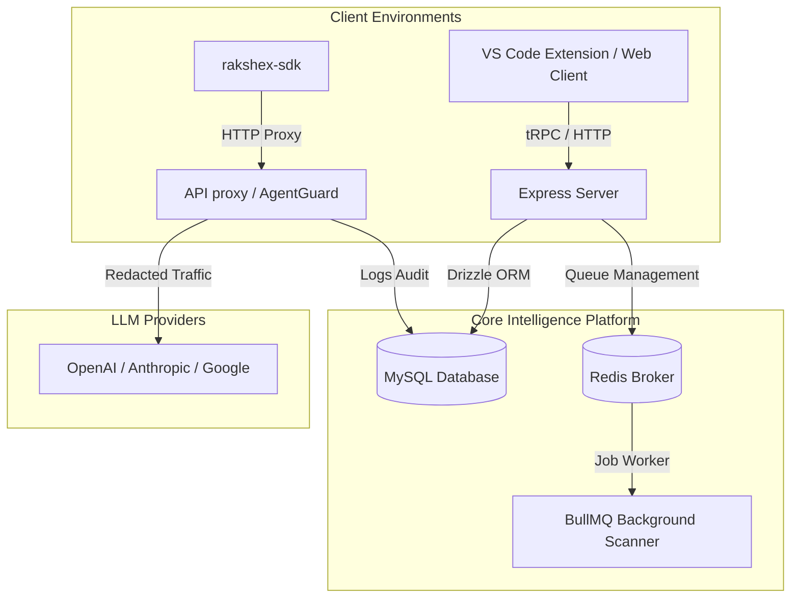

# ⚡ RakshEx — Unified API Security & LLM Cost Intelligence

RakshEx is the industry's first developer-native **AgentGuard** and **API Security Scanner** built directly where developers live: inside **VS Code**.

It simultaneously bridges API vulnerability scanning (OWASP Top 10 + DAST) and real-time Large Language Model (LLM) cost intelligence (reasoning token attribution + autonomous agent loops kill-switches) in a single, unified development workflow.

---

## 🏗️ Architectural Overview

RakshEx operates on a **Dual-Engine Architecture** integrated directly into the developer workflow.



---

## 🛠️ The Dual Engines

### 1. The API Security Engine

- **OWASP Top 10 Scanning:** Automated scanning on target endpoints for BOLA, BFLA, rate-limiting deficits, and input validation gaps.
- **Credential Leak Detection:** Recursive AST parsing of workspace code and uploaded files to prevent secrets leakage before syncing.
- **Static Shadow API Scanner:** Extracts router definitions across key frameworks (Express, FastAPI, Django) from files and cross-references them against active traffic.
- **Indian DPDP 2023 & PCI DSS Compliance:** Built-in validation rules for Indian PII patterns (Aadhaar, PAN, GSTIN, IFSC, UPI ID, Phone numbers) and automated evidence reporting.

### 2. The Cost Intelligence & AgentGuard Engine

- **Thinking Token Isolation:** Separates standard input/output tokens from reasoning tokens (for o1/o3/Opus) and calculates Timing timing signatures.
- **Per-Feature Cost Attribution:** Fine-grained usage logs attributed to specific code modules and features.
- **Autonomous Kill-Switch:** Real-time stream interception proxy that automatically severs API keys when budget limits or loop thresholds are exceeded.

---

## 📂 Project Structure

```
temp_clone/
├── server/                  → tRPC Backend API (Express + MySQL + Redis)
│   ├── api/                 → Webhook, scanning, shadow API endpoints
│   ├── db.ts                → Drizzle ORM transactions & connection pool
│   ├── engines/             → Credential & PII scanner engines
│   └── services/            → Scan schedulers, imports, compliance generators
├── rakshex-frontend/       → Next.js SaaS Web Dashboard (React + HSL styling)
├── rakshex-vscode/         → VS Code Extension Source (Static Router Extraction)
├── packages/
│   └── rakshex-sdk/        → Client Telemetry SDK (Auto-redaction pipeline)
├── github-action/           → CI/CD Pull Request Scan Action
├── drizzle/                 → Database Schema & Migration files
└── test-labs/               → Vulnerable sandboxes for local exploit simulation
```

---

## 🚀 Quickstart: Local Development

### 1. Prerequisites

Ensure you have Node.js 22+ and a local MySQL + Redis instance running (or run them via Docker):

```bash
npm run db:up   # Starts MySQL & Redis containers
```

### 2. Configure Environment Variables

Copy `.env.example` to `.env` in the root directory and update with your local secrets:

```bash
cp .env.example .env
```

### 3. Install Dependencies

Run the command in the workspace root:

```bash
npm install
```

### 4. Database Migrations

Initialize database schemas and apply current schema migrations:

```bash
npm run db:migrate
```

### 5. Running the Stack

Run the development servers concurrently:

```bash
npm run dev
```

---

## 🧪 Testing & Verification

RakshEx maintains a zero-regression policy with a fully automated testing suite.

### 1. Static Type Checking

Compile all submodules (Root, Frontend, VS Code Extension) without emitting files to verify typescript safety:

```bash
npm run check
```

### 2. Run Test Suite

Run unit, integration, and E2E endpoints checks:

```bash
npm run test:all
```

This runs:

- **`npm run test:server`** (596 tests for backend logic & transactions)
- **`npm run test:frontend`** (30 tests for dashboard widgets & auth routing)
- **`npm run test:vscode`** (14 tests for static route parsing)

---

## 🚀 Production Deployment

To package and deploy RakshEx to production:

1.  **Dockerize Build:**
    Use `Dockerfile.prod` and `docker-compose.prod.yml` to package and build the runtime image:
    ```bash
    docker build -f Dockerfile.prod -t rakshex-app:latest .
    ```
2.  **Stripe/Razorpay Webhooks:**
    Set up appropriate webhook bindings in `server/payments.ts` to trigger subscription upgrades and scan quota replenishment.
3.  **VS Code Extension Packaging:**
    Package the extension bundle into a `.vsix` ready to be uploaded to the extension marketplace:
    ```bash
    cd rakshex-vscode
    npx @vscode/vsce package
    ```

---

_RakshEx by Rashi Technologies · 2026_
